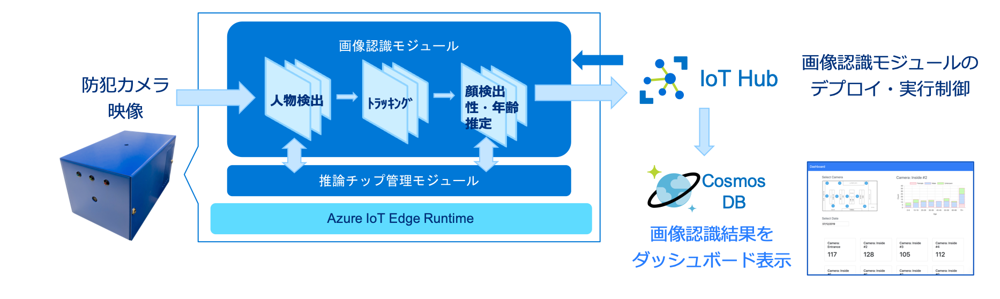

# Smart Camera Reference Implementation

このリポジトリは、[マイクロソフト「Smart Store」リファレンスアーキテクチャー](https://news.microsoft.com/ja-jp/2019/01/29/blog-smart-store/) に基づくサンプル実装です。

(See [here](README.md) for English documents)

## 概要

### Smart Cameraとは？

- ディープラーニングベースの画像認識エンジンにより、防犯カメラ映像を分析可能なエッジデバイスです。本リファレンスアーキテクチャでは、エッジ用の高速推論チップを活用することで、高速・高精度な人物検出、人物トラッキング、顔検出、顔からの性別・年齢推定を実現しています。
- エッジデバイスでの画像認識結果は、**Azure Cosmos DB** に格納されます。当該格納されたデータは、ダッシュボード上にて人流分析や客層分析結果として表示が可能です。
- エッジデバイス上で動作する画像認識モジュールは、**Azure IoT Hub** を利用して、デプロイ・実行・停止の制御が可能です。例えば本アーキテクチャの画像認識モジュールをリプレースすることで、商品認識等、別用途の分析も可能です。

## Getting Started

- エッジデバイスセットアップ手順：[Azure IoT エッジデバイスをデプロイする](src/inference-app/azure/README.ja-JP.md)
- ダッシュボードサーバセットアップ手順：[ダッシュボードサーバをデプロイする](src/test-server/arm-template/README.ja-JP.md)

## 補足資料

- Smart Camera の全体構成については、[こちら](docs/architecture.ja-JP.md)をご参照ください
- サンプルユースケースについては、[こちら](docs/usecase.ja-JP.md)をご参照ください
- 処理シーケンス及びデータフローについては、[こちら](docs/dataflow.ja-JP.md)をご参照ください
