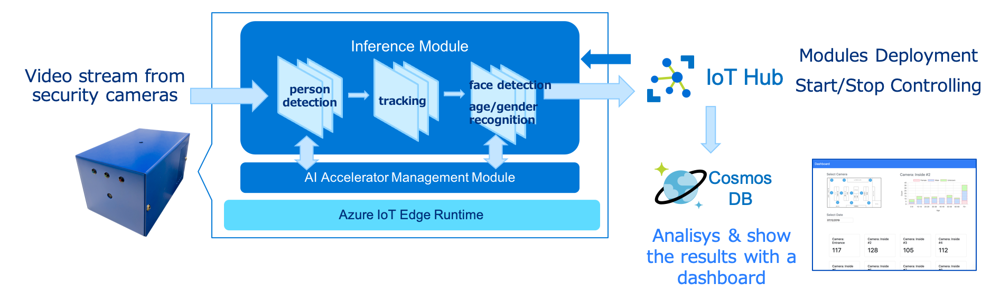

# Smart Camera Reference Implementation

*This repository is based on the [Microsoft Smart Store Reference Architecture](https://news.microsoft.com/ja-jp/2019/01/29/blog-smart-store/)*

（日本語版 README は[こちら](README.ja-JP.md)をご参照ください）

## Overview

### What Is a Smart Camera?

- It's an edge device which is based on a deep-learning inference engine for analyzing the video streams taken by itself or from a security camera. In this implementation, we use AI accelerators for edge devices to achieve the high-speed & high-accuracy person detection, person tracking, face detection and age/gender recognition tasks.
- The inference results sent from the edge device will be saved into **Azure Cosmos DB**, calculated by a server and displayed on a dashboard as the results of customer flow and age/gender distribution.
- The inference modules running on the edge device are managed by **Azure IoT Hub**. You can easily replace the modules by some other modules for different purpose such as product recognition to make your own Smart Camara system.

## Getting Started

- To setup your edge device, follow this instruction: [Deploy Azure IoT Device](src/inference-app/azure/README.md)
- To setup a dashboard server, follow this instruction: [Deploy Dashboard Server](src/test-server/arm-template/README.md)

## More Details

- For the whole architecture of Smart Camera system: see [this page](docs/architecture.md).
- An example use case: see [this page](docs/usecase.md).
- Processing sequence and data flow graphs: see [this page](docs/dataflow.md).
