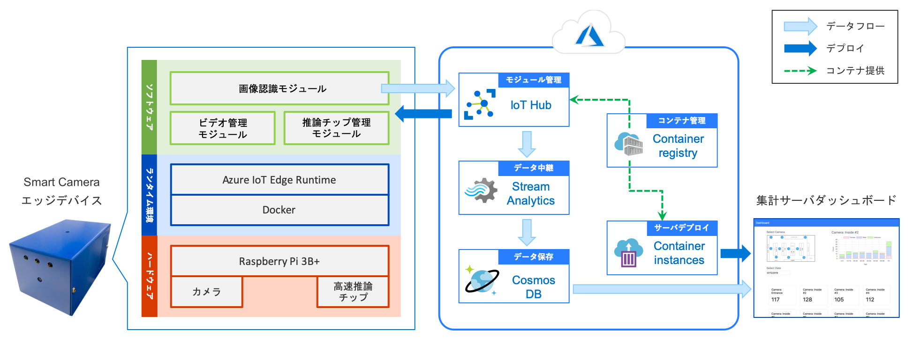
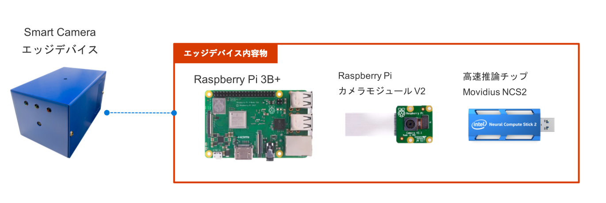
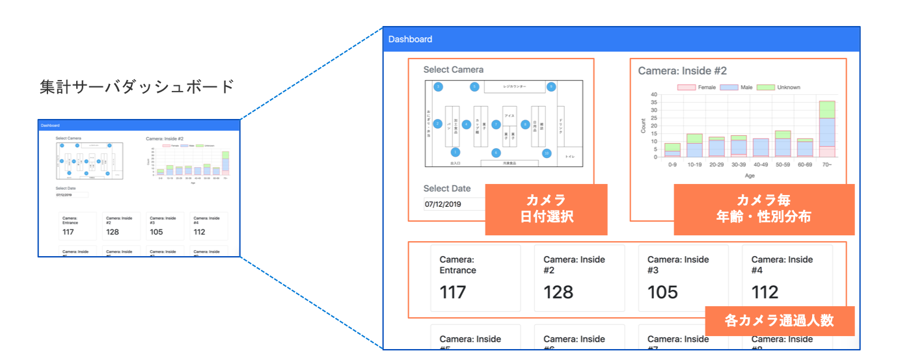

# Smart Camera 全体構成

### ハードウェア機能と特長

- エッジデバイスは全て市販のハードウェアで構成されています。このため、誰でも安価かつ簡単に購入・作成可能です。
    - 安価な Raspberry Pi 3B+ をベースにしています。
    - Raspberry Pi カメラモジュール V2 にて、エッジデバイスに映像を入力可能です。
    - 市販のエッジ用高速推論チップ（Movidius NCS2）を利用した、高速な CNN（畳み込みニューラルネットワーク）ベースの人物検出が可能です。

### ソフトウェア機能と特長

- エッジデバイスに Docker エンジン及び Azure IoT Edge Runtime 搭載。これにより、Azure IoT Hub を利用した、パワフルかつ容易なモジュールの管理・制御を実現しています。
- エッジ側アプリケーションは3つのモジュールに分けられています：
    - **画像認識モジュール**
        - エッジ用の高速推論チップを利用した防犯カメラ映像分析を行います。本アーキテクチャではカメラ映像からの人物検出、人物トラッキング、顔検出及び顔からの性別・年齢推定を実現しています。
        - モジュールのデプロイ・実行・停止・更新は Azure IoT Hub によって管理、制御されています。モジュールを差し替えることで、例えば商品認識等の別用途の分析も可能になります。
    - **推論チップ管理モジュール**
        - 市販の高速推論チップを利用するためのライブラリ及びそのチップに特化したプログラムを搭載しており、画像認識タスクを高速に行います。（本アーキテクチャでは推論チップとして Intel 社の Movidius NCS2 を使用しています）
    - **ビデオ管理モジュール**
        - エッジデバイス自身のカメラ、ビデオファイル、RTSP 対応の防犯カメラと多彩な入力ソースに対応しています。
        - 入力映像をバッファリングし、推論チップの処理能力に応じた逐次処理を行います。例えば開店時間の録画映像を、閉店時間後の時間を利用して処理を完了させる、といったことも可能です。

### サーバサイド機能と特長

- エッジデバイス、集計サーバ及びコンテナの管理を Azure クラウド上で一元化し、管理コストを低減します。
    - [Azure IoT Hub](https://azure.microsoft.com/ja-jp/services/iot-hub/) を通して、エッジデバイスの状態確認及びエッジデバイス上で走るモジュールの管理ができます。
    - 画像認識モジュールによる認識結果は、[Azure Stream Analytics](https://azure.microsoft.com/ja-jp/services/stream-analytics/) ジョブを経由し、[Azure Cosmos DB](https://azure.microsoft.com/ja-jp/services/cosmos-db/) に保存されます。
    - [Azure Container Instances](https://azure.microsoft.com/ja-jp/services/container-instances/) によって集計サーバを立ち上げ、保存された認識結果を集計し、各カメラの通過人数及び年齢性別分布を図示するダッシュボード機能を提供します。
    - [Azure Container Registry](https://azure.microsoft.com/ja-jp/services/container-registry/) によって、エッジデバイスモジュール及び集計サーバの元となるコンテナを管理します。

