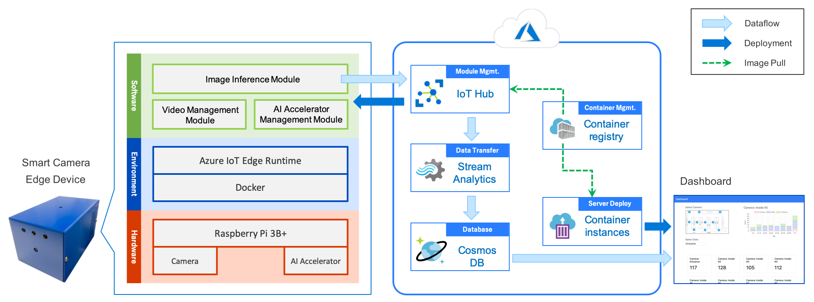
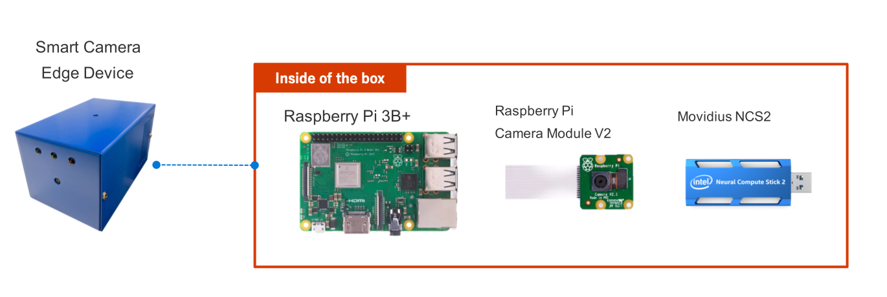
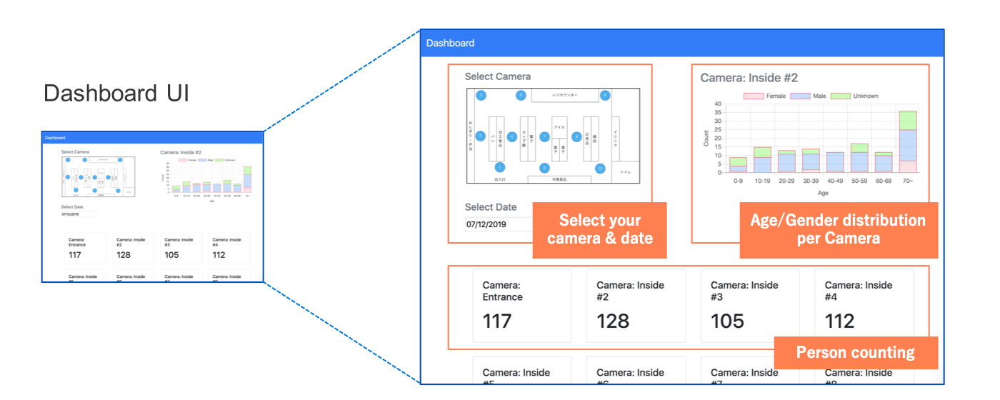

# Architecture of Smart Camera System

### Hardware of Edge Device

- You can buy all of the hardware components from a store or from the Internet with an inexpensive price, make it easier and quicker for building an AI-based Smart Camera system in your store.
    - Raspberry Pi 3B +
    - Raspberry Pi camera module V2
    - Movidius NCS2 (a high-speed AI accelerator for edge computing made by Intel)

### Edge-side Architecture

- Equipped with Docker engine and Azure IoT Edge Runtime on our edge device. It enabled us to manage the applications easily by the powerful module management service of Azure IoT Hub.
- Edge-side application is divided to 3 modules:
    - The image inference module. It is designed as a top level manipulator of the whole application. It gives instructions to the AI accelerator management module and receives raw inference results from it. After doing some post-processes, it will send the inference results to the Azure IoT Hub via IoT Hub SDK. It should be easily replaced by other modules that could make other kind of analysis - such as product recognition - possible for the Smart Camera system.
    - The AI accelerator management module. It contains some well-designed libraries and programs specifically for a particular AI accelerator chip. In this implementation, we use Movidius NCS2 and OpenVINO provided by Intel to make high-speed edge-side inference possible.
    - The video management module. It can receive video data from several kinds of sources such as Raspberry Pi camera and RTSP camera, save them as files and provide the decoded frames to the AI accelerator management module if it needed. It can also use video files directly as the input source.

### Server-side Architecture

- We use Microsoft Azure to manage the whole Smart Camera system including edge devices, containers and calculation server to reduce management costs.
    - Through [Azure IoT Hub](https://azure.microsoft.com/en-us/services/iot-hub/), you can check the status of each edge devices and manage all of the modules running on them easily.
    - The inference results sent from the edge devices will be aggregated by [Azure Stream Analytics](https://azure.microsoft.com/en-us/services/stream-analytics/) jobs, then stored in [Azure Cosmos DB](https://azure.microsoft.com/en-us/services/cosmos-db/) for further analysis.
    - [Azure Container Instances](https://azure.microsoft.com/en-us/services/container-instances/) launches a calculation server that takes the inference results data from the DB, analysis the data and shows the analysis results on the dashboard.
    - [Azure Container Registry](https://azure.microsoft.com/en-us/services/container-registry/) will manage all of the container images for you, which are where the IoT Hub modules and the server instance come from.

