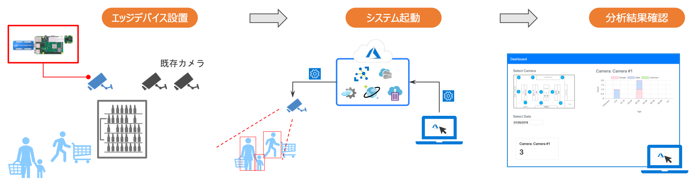

# ユースケース

本 Smart Camera システムを店舗内に設置し、人流分析と客層分析を行う際の処理の流れについて説明します。

1. **エッジデバイス設置**：既存の防犯カメラと同じ要領でエッジデバイスを設置します。顔を真正面から捉えられる位置、例えばエントランスに水平に近い角度で設置すると、顔の検出が容易になり、客層分析の精度が上がります。
1. **システム起動**：Azure クラウドを通してエッジデバイス上に画像認識用のアプリケーションをデプロイして実行します。これにより、エッジデバイス側で画像認識が開始され、認識結果がクラウド上に伝送されます。また、Azure クラウド上に集計サーバを立ち上げます。
1. **分析結果確認**：集計サーバの URL にアクセスし、ダッシュボードにて人流・客層の分析結果を確認します。

