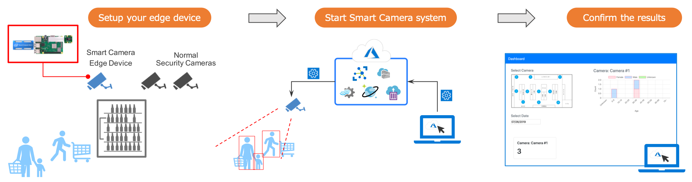

# A Use Case of Smart Camera System

This repository can be deployed as-is to achieve customer flow analysis and age/gender distribution analysis tasks.

1. **Setup your edge device:** setup your edge device as the same way with your security cameras. Please be noted that you can set the edge device with a low angle to get a higher accuracy of age/gender analysis since it will be easier to detect faces of customers.
1. **Start Smart Camera system:** deploy the inference application to your edge device via Azure cloud. The application itself will automatically start to work and send the inference results back to the cloud. You will also setup your calculation server on the Azure cloud to catch up all of these results and show them with a dashboard.
1. **Confirm the results:** access to your dashboard and check the analysis results out.

